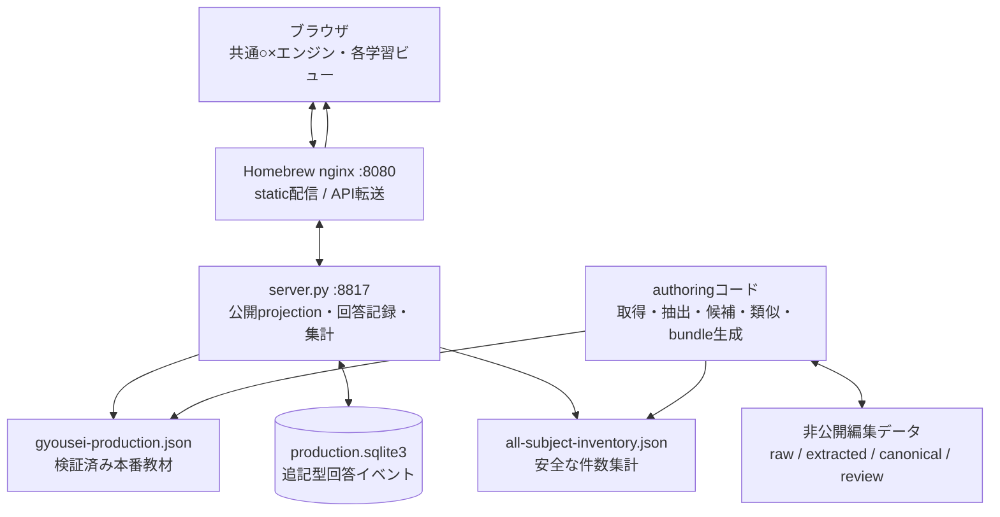
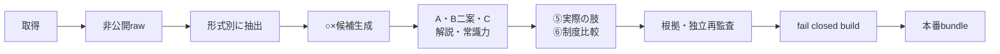
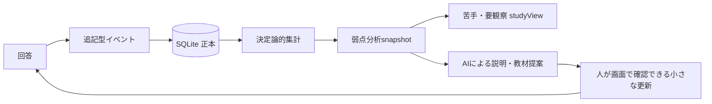

# 行政書士 過去問ラボ 全体構成

- `architectureVersion`: `2026-08-03`
- 更新日: 2026-08-03 JST
- 人間向け構成図: `static/architecture.html`
- AI向け正本: このファイル

このラボは、2026年11月8日の行政書士試験へ向けて、本人が問題を解きながら教材と分析機能を育てる長期プロジェクトである。8月は開発中心、9月から本格学習に入る。直近10年の過去問は全6科目を一つのアプリに掲載済み。○×学習カードは**全6科目221件**を掲載済みである（行政法77、基礎知識39、民法45、憲法24、商法・会社法24、基礎法学12）。

## 1. 到達したい状態

**主役は○×学習カードで、過去問569問はおまけである（2026-08-02に確定）。**
このラボはカードを繰り返し解いて論点を体に入れるための道具であり、過去問は本番での聞かれ方の確認と、
カードの根拠（⑤ 実際の肢）を示すための参照用に置いてある。569問を周回するのは主な使い方ではない。
新しい学習機能はまずカード側で作り、過去問側へ同じものを二重に作らない。
初見問題の取り置き（holdout）も作らない。569問を暗記するほど周回しないうえ、
直近4年度は利用者が実際に受験しており、そもそも初見ではないためである。

- 行政法、民法などを科目別に解ける。
- 全分野の頻出論点だけを横断して解ける。
- 正答率の高い「習得済み」と手動の「絶対覚えた」を通常出題から外し、全問題モードではどちらも再表示できる。
- 回答履歴をサーバーの追記型SQLiteへ保存する。
- AIが集計結果を読み、不得意分野・直近誤答・遅い問題を説明できる。
- 苦手専用の学習ビューや補強カードを、20〜30論点単位で追加できる。
- 行政法と民法など、科目をまたぐ「似ているが結論が違う制度」を関連表示できる。
- 取得素材、編集途中、検証済み本番教材を混ぜない。
- 人間向けHTMLとAI向け本書で、構成を継続的に把握できる。

## 1.5 得点計画（教材の優先順位を決める土台）

**この計画が、どの科目のカードを何枚作るかを決める。** 機能追加や論点選定で迷ったら、ここへ戻って
「180点までの距離をいちばん縮めるのはどれか」で判断する。2026-07-27に利用者と合意し、
2026-07-28に合格者体験談の調査を踏まえて改訂、同日さらに利用者の受験実績を踏まえて
**目標を1点の的から幅のある帯へ変えた**（下の「1.5.1 なぜ帯で持つのか」）。

### 配点

以下は直近で形式まで確定している令和7年度を使った計画値である。令和8年度の試験案内で確定しているのは
法令等46問・基礎知識14問、法令基準日2026年4月1日までで、詳細形式が変わった場合はこの表も更新する。

| 科目 | 択一 | 多肢選択 | 記述 | 合計 |
| --- | --- | --- | --- | --- |
| 行政法 | 19問76点 | 2問16点 | 1問20点 | **112点** |
| 民法 | 9問36点 | — | 2問40点 | **76点** |
| 憲法 | 5問20点 | 1問8点 | — | 28点 |
| 商法・会社法 | 5問20点 | — | — | 20点 |
| 基礎法学 | 2問8点 | — | — | 8点 |
| 基礎知識 | 14問56点 | — | — | **56点** |

合格は総得点180点以上、法令等122点以上、基礎知識24点以上の3条件を同時に満たすこと。

### 1.5.1 なぜ帯で持つのか

利用者はこれまで4回受験しており、**総得点は120〜170点の範囲で大きくブレている**。
一方で旧一般知識は44・56・48・44点と安定して高い。他の受験者の体験談でも、模試や本試験のたびに
20〜30点の振れ幅が出るのが普通である。

したがって、**「196〜200点」のような幅5点の的を狙う計画は立てられない**。
狙うのは点ではなく帯で、次の形にする。

- **ふつうの年で190〜200点**
- **悪い年でも180点以上**を実戦上の目標にする
- 上振れした年は200点を超える

170〜179点は合格に届かないため、目標帯には含めず**下振れ警戒帯**として扱う。
1回の受験で100%合格を保証する計画ではないが、未見・時間制限付きの全分野演習で
最低点が180点を超える状態を作り、そのうえで下振れの幅を教材で狭める。

### 目標の内訳（ふつうの年192点／下振れ警戒線170点）

2026-07-28に、合格体験談9例の調査（`docs/PASS_STRATEGY_RESEARCH_WITH_RAMUNEGU.md`）を受けて
形式別の数え方へ改訂した。**形式ごとに分けて数え、記述を科目の総点へ埋め込まない。**
記述は採点基準が非公表で読みにくいため、「記述を除いていくら取れているか」を常に見えるようにしておく。

| 区分 | 満点 | 下振れ警戒線（合計170） | ふつうの年（合計192） | 考え方 |
| --- | ---: | ---: | ---: | --- |
| 行政法・択一 | 76 | 60点（15/19） | 64点（16/19） | **最大の得点源。ここが崩れた年が、そのまま下振れの年になる** |
| 基礎知識 | 56 | 40点（10/14） | 44点（11/14） | 足切りは24点だが、**利用者は旧一般知識で44〜56点の実績がある。ここは崩れにくい** |
| 民法・択一 | 36 | 20点（5/9） | 24点（6/9） | **深追いしない。A論点だけ理由まで、その他は制度名・要件・効果で通す** |
| 多肢選択 | 24 | 14点（7空欄） | 16点（8空欄） | 空欄ごとに2点。**完全正解を狙わず、確実な語から埋める** |
| 記述 | 60 | 16点 | 20点 | **別枠で数える。0点前提にはしないが、40点以上にも依存しない** |
| 憲法・択一 | 20 | 12点（3/5） | 16点（4/5） | 範囲が狭く、繰り返し出る |
| 商法・会社法 | 20 | 4点（1/5） | 4点（1/5） | **20点しかないので時間を使わない。頻出だけ確実に** |
| 基礎法学 | 8 | 4点（1/2） | 4点（1/2） | 範囲が広く費用対効果が低い。深入りしない |
| **合計** | **300** | **170点** | **192点** | |

3条件との関係は次のとおり。170点の警戒線では科目別足切りには当たらないが、
総得点が10点不足する。

| 条件 | 基準 | 下振れ警戒線 | ふつうの年 |
| --- | ---: | ---: | ---: |
| 総得点 | 180以上 | 170（**不足10点**） | 192 |
| 法令等 | 122以上 | 130 | 148 |
| 基礎知識 | 24以上 | 40 | 44 |

記述を除いた素点は、下振れ警戒線で154点、ふつうの年で172点。
**記述が0点でも法令等の足切りは通る。**

### この帯の使い方

- 170点の列は「ここへ入ったら不合格」という**警戒線**であって、目標ではない。
- ふつうの年の列と実際の正答率の差が、そのまま**次に作る教材の優先順位**になる。
- 行政法・択一が15/19を割る状態が続くなら、他科目のカードを増やす前に行政法へ戻る。
- 商法・会社法と基礎法学は、警戒線とふつうの年で数字を変えていない。
  **伸ばす対象ではなく、落としても壊れないことを確認するための枠**である。

改訂の経緯:

- 2026-07-27: 基礎知識36点・総合192点。記述を行政法88点・民法40点の中へ含めていた。
- 2026-07-28（1回目）: 記述を別枠へ出し、基礎知識を40〜44点へ上げ、本命を196〜200点とした。
  調査した令和6・7年度の合格者9例では、**記述抜きで180点以上に届いたのは3人、記述を加えて初めて
  180点に届いたのが6人**だった。記述を科目の総点へ溶かし込むと、この差が見えなくなる。
- 2026-07-28（2回目）: 本命196〜200点という幅5点の目標は、**利用者の実際の振れ幅（120〜170点）に対して
  狭すぎる**という指摘を受け、悪い年170点／ふつうの年192点の2列へ組み替えた。
- 2026-07-29: 170〜179点は不合格帯なので「悪い年の目標」ではなく警戒線へ名称を変更し、
  実戦目標を悪い年でも180点以上、通常190〜200点と明記した。

### 教材づくりへの落とし込み

- **行政法**は行政手続法・行政不服審査法・行政事件訴訟法を主軸にする。**地方自治法は控えめ**にし、
  繰り返し出ている論点（住民訴訟、条例制定権、国の関与と争訟）だけカード化する。
- **民法**はカード枚数の上限を意識する。範囲が広く、深追いすると数百時間かかる。
  択一で問われる形と記述で問われる形を**同じカード**に持たせ、記述専用の勉強時間を作らない。
- **基礎知識**は範囲が閉じている分野から作る。**個人情報保護法、情報通信、行政書士法等の業務関連法令**は
  費用対効果が高い。令和6年度からの新制度では、諸法令（行政書士法・戸籍法・住民基本台帳法）が
  毎年2問、個人情報保護が毎年1問、文章理解が3問という配分が2年続いている。
  政治・経済・社会は範囲が広いので頻出テーマに絞る。
  **文章理解3問（12点）はカードに向かない**（解き方の訓練なので過去問演習で扱う）。
  **一般知識（問47〜52・6問24点）は制度の骨格だけをカード化する。** 米価・中東情勢・G7の開催地のような
  一問限りの時事は再出題がないので入れない。20年集計でも繰り返しが確認できたのは、
  ジェンダー・平等・差別（8問/7年度）、選挙・政党・政治制度（8問/7年度）、経済・金融・財政（17問/9年度）である。
- **基礎法学**は12枚である（2026-07-29）。20年間、**問1が空欄補充（法史・法思想）で対策しにくく、問2が法令用語・裁判制度・法令の効力で安定している**ため、問2枠だけへ集中させた。当初10枚で打ち止めとしたが、20年集計で残っていた「法令の効力・形式」の穴（14問・12年度）を埋めるため、条・項・号と枝番号、公布と施行の2枚を足した。目標1/2点はこれで足りる。
- **学習カードの正本はGitリポジトリの `content/explanation_cards.json`**（2026-07-30に非公開編集データ配下から移動）。手で頻繁に書き換える著作物なので、変更履歴と差分レビューをGitに持たせる。取得スナップショット・⑤の出典・頻出度監査・SQLiteは従来どおり非公開領域が正本で、ソース側へ持ち込まない。`content/` はnginxの配信対象外なのでWebへは出ない。
- **頻出度監査JSONは187枚まで統合済みで、2026-07-31追加の13枚が未統合**（2026-08-02確認）。
  画面側には頻出度metadataがあるが、監査正本と一致するまでは完了扱いにしない。ラベルは問題数で機械的に決める
  （1〜2=重要論点、3〜5=繰り返し出題、6〜9=頻出、10以上=最頻出）。基礎知識は制度変更を踏まえて
  直近10年を原則とし、制度導入後しか比較できない個別カードも実際に数えた期間を`scope`へ明記する。
- **商法・会社法**は24枚を掲載している。最初の15枚は問36の商法総則・商行為と問37の設立を中心にしたが、20年分を再点検すると、問38〜40にも株式・機関・計算の安定した頻出論点があった。そのため、議決権制限種類株式、取締役会の特別利害関係人、監査役会、分配可能額など6枚を追加し、さらに譲渡制限株式、監査等委員会、株主総会決議の3枚を補った。ただし得点計画は5問中1問が基準なので、今後は枚数を機械的に増やさず、実際の誤答か明確な頻出漏れがあるときだけ補う。
- **科目をまたぐ混同**（民法の代理と商法の表見支配人、民法の時効と行政法の出訴期間、民法の不法行為と
  国家賠償法1条など）は⑥`crossFieldComparisons`で必ず触れる。試験本番で最も事故が起きる箇所である。

### 「確信のない170点」を見抜く

過去問を繰り返すと、**理由を言えないまま正解できる状態**が増える。この状態の170点と、
説明できる170点は本番での意味が違う。2026-07-29に、回答ごとの自信度（確信あり／たぶん／
あてずっぽう）を`card_marks`へ残せるようにした。出題対象の判定には効かせず、
表面上の得点と「理由まで言える得点」を分けて見るための材料として貯める。

### 速さも得点のうち

択一は1問あたり2分、肢1本あたり約24秒しか使えない。正誤だけでなく**解答時間**を記録・表示し、
「正解できるが時間がかかる」カードを可視化する。ただし習得済みの判定条件に時間は入れない
（単純な問題だけが早く卒業し、複雑な問題が永久に残る歪みが出るため）。

## 2. 設計原則

1. 回答履歴の正本は `production.sqlite3`。AIは履歴を直接書き換えない。
2. 科目別・全分野頻出・弱点は別アプリや別DBにせず、共通エンジンの `studyView` として作る。
3. 問題ID・カードID・回答revisionを安定させ、教材更新後も過去履歴を失わない。
4. 過去問の保存数、元の肢数、○×候補数、本番公開カード数を別の指標として扱う。
5. 自動類似度は候補探索に使い、学習上の関係は根拠付きのreview済みデータとして保存する。
6. 大量生成より、小さな教材リリースと実際の回答による反復を優先する。
7. 取得元本文・解説は非公開編集領域に置き、ブラウザへ返さない。
8. 2026年度向け法令基準日は `2026-04-01`。
9. 頻出度の正本はreview済みのカード×原問監査データとし、候補単体の
   `frequencyEligible`や文字類似の集計を正本にしない。

## 3. システム構成



### ソース

| 対象 | 場所 |
|---|---|
| アプリ | `~/dev/yuki-services/apps/gyousei-lab/` |
| 静的UI | `static/` |
| API | `server.py` |
| APIテスト | `tests/` |
| 取得・編集・生成コード | `authoring/` |
| 人間向け構成図 | `static/architecture.html` |

### 実行時・非公開データ

| 対象 | 場所 |
|---|---|
| 本番bundle | `~/.local/share/yuki-services/gyousei-lab/gyousei-production.json` |
| 回答履歴 | `~/.local/share/yuki-services/gyousei-lab/production.sqlite3` |
| 最新の弱点分析 | `~/.local/share/yuki-services/gyousei-lab/weakness-latest.json` |
| 世代別の弱点分析 | `~/.local/share/yuki-services/gyousei-lab/analytics/snapshots/` |
| 公開可能な件数集計 | `~/.local/share/yuki-services/gyousei-lab/all-subject-inventory.json` |
| 非公開編集データ | `~/.local/share/yuki-services/gyousei-lab/authoring/` |
| 全分野20年分 | `…/authoring/all_subjects/` |

ソースと実行時データを混在させない。本番DB、bundle、raw、provider解説、AI生ログをソース管理へ入れない。

## 4. 教材作成のデータフロー



### データ層

1. `raw` / `extracted`
   - 取得証跡と問題形式を保存する。
   - provider解説は非公開資料。
2. 候補・編集正本
   - 通常5肢を、安全に真偽推定できる時だけ肢へ分解する。
   - 組合せ、個数、多肢選択、記述、没問、正解なしは問題単位のreview queueへ残す。
3. canonical
   - 安定したID、科目、論点、A・B二案・C、正解、解説、根拠、⑤、必要な⑥を持つ。
   - `sourceRefs` はそのカードの出どころを指す。公開bundleへ出す段階で
     `related_question_source.json` の `records` から出題年度・問番号・公開URLだけを引き、
     画面のカードID行に「元問題」リンクとして出す。カード側にURLを直接書かない。
4. build / release
   - schema・参照・件数・内部情報漏洩を検証したbundleだけをatomicに本番へ置く。

### 用語の区別

| 用語 | 意味 |
|---|---|
| 問題単位 | 本試験の問番号1つ。択一・多肢・記述を各1問と数える |
| 通常選択肢 | 通常5肢択一の元の肢。原則1問5肢 |
| safe ○×候補 | 正解番号だけから各肢の真偽を安全に決められる厳格候補 |
| 派生カード | 多肢・記述の論点などから独自に作った○×教材 |
| 公開カード | 本番画面へ検証済みとして掲載した教材 |

古い年度のsafe候補は「当時の答えから構造上分解できる」という意味であり、2026年基準の正誤確認済みという意味ではない。

## 5. 現在のデータ量

件数の再現可能な正本は、非公開データから
`gyousei-dataset-inventory` で生成する `data_inventory.json` である。ブラウザへは、問題文・解説・パス・内部IDを含まないruntimeコピーだけを返す。

### 平成18年度〜令和7年度

| 科目 | 問題単位 | 通常5肢の原肢 | safe ○×候補 | 多肢選択 | 空欄 | 記述 |
|---|---:|---:|---:|---:|---:|---:|
| 基礎法学 | 40 | 200 | 75 | 0 | 0 | 0 |
| 憲法 | 120 | 500 | 395 | 20 | 80 | 0 |
| 行政法 | 440 | 1,900 | 1,375 | 40 | 160 | 20 |
| 民法 | 220 | 900 | 555 | 0 | 0 | 40 |
| 商法・会社法 | 99 | 495 | 310 | 0 | 0 | 0 |
| 基礎知識 | 220 | 1,100 | 585 | 0 | 0 | 0 |
| 合計 | 1,139 | 5,095 | 3,295 | 60 | 240 | 60 |

試験全体は1年60問なので20年なら理論上1,200問である。保存数が1,139問なのは、問58〜60の本文が著作権上の理由で20年分60問なく、さらに2017年度問39が取得元の年度一覧にないためである。

行政法440問は全試験ではなく、毎年の行政法22問（通常19、多肢2、記述1）を20年分数えたもの。

### 現在の本番掲載

- 全6科目569問（直近10年）
  - 基礎法学20、憲法60、行政法220、民法110、商法・会社法49、基礎知識110
- ○×学習カード221件（行政法77、基礎知識39、民法45、憲法24、商法・会社法24、基礎法学12）
  - 記述式で繰り返し問われる論点のうち、択一に元肢がある6論点もカード化した
  - 基礎知識は一回限りの時事を増やさず、制度の骨格を優先して39枚とした
  - 憲法は総論3枚（実質的意味の憲法、硬性憲法と改正手続、憲法尊重擁護義務の名宛人）を足して24枚とした
  - 基礎法学は法令の形式2枚（条・項・号と枝番号、公布と施行）を足して12枚とした
- 関連過去問肢717件
- 記述30問（行政法10、民法20）
- 類似候補588組

保存素材1,139問と、本番掲載569問・200カードを混同しない。

カードは**実際に出題された論点だけ**から作る。過去20年に一問も出ていない条文を、法改正が
あったという理由だけでカードにしない。改正は既存の頻出カードを現行法へそろえる形で反映する。
判断基準は `authoring/CARD_AUTHORING.md` の「1.1 出題された論点だけをカードにする」。

## 6. 回答履歴と弱点分析



現状:

- SQLite schema `user_version=4`。
- `answer_attempts`、`card_attempts`、`card_marks`、`similarity_decisions` は追記型。
- client生成 `eventId` で再送を冪等にする。
- `answerRevision`は回答時に見ていた版の記録として残すが、習得・卒業・弱点の集計では見ない。
- A・B・C・正解・法令基準日のどれを直しても、同じカードIDなら履歴を引き継ぐ（2026-07-30に変更）。論点そのものを変える場合だけ新しいカードIDにする。

### 6.1 卒業・絶対覚えた・自信度

出題から外す仕組みは2層ある。どちらも `card_marks`（追記型）に記録し、
`card_attempts` の行は書き換えも削除もしない。

| 層 | 付き方 | 外れる範囲 | 全リセット | 解除の導線 |
| --- | --- | --- | --- | --- |
| 習得済み | 自動（`正解 − 不正解 >= 3`） | おまかせのみ | 対象 | 一覧の「習得をリセット」 |
| 絶対覚えた | 手動（回答後のボタン） | おまかせ・苦手ビュー | **対象外** | 一覧の「「絶対覚えた」を解除」 |

- `action` は `certain` / `uncertain` / `reset` / `confidence` の4種類。
  `reset` だけが `scope='deck'`（全リセット）を取れる。
- `reset` は「ここより前の回答を習得判定に数えない」という区切りを置くだけで、
  回答そのものは残る。したがってリセット後も `correct` / `incorrect` は減らない。
- 過去に卒業した事実は `graduatedTimes` / `lastGraduatedAt` として残り、
  解除してもリセットしても消えない。あとからAI分析で使う。
- 自信度（`sure` / `likely` / `guess`）は回答1件につき1つまで。
  `attemptEventId` で回答と結び付けるだけで、**出題対象の判定には一切効かない**。
- 出題範囲の「卒業済みだけ」は、この2層に入ったカードの一覧を兼ねる。
  **「全問題を出す」と「卒業済みだけ」では、絶対覚えたカードも出題する。**
  「絶対覚えた」は普段のおまかせ周回から外す印であり、永久非表示の指定ではない。

実装済みの弱点分析MVP:

```text
analytics/snapshots/<timestamp>.json
weakness-latest.json
```

`weakness_analysis.py`が本番SQLiteを読み取り専用で開き、
`gyousei-weakness-snapshot@1`を`0600`でatomic生成する。SQLiteの行やschemaは
変更しない。snapshotは次を持つ。

- `generatedAt`, `analyzerVersion`, `bundleRevision`, `maxAttemptId`
- 科目・topic・subtopic別のカード数、回答数、正解、不正解、正答率
- そのカードIDの直近5回答、連続正誤、最終回答、所要時間
- `targets[]`: cardId、priority、status、reasonCodes、根拠数値
- deck外、未知カードを除外した件数

MVPの判定:

- `unlearned`: そのカードの回答0回
- `learning`: 誤答がなく、習得条件にはまだ達していない
- `watch`: 誤答が1回だけ、または最新誤答だが苦手条件未満
- `weak`: 誤答が2回以上あり、直近2回が連続誤答、または直近5回中
  2回以上誤答かつ正答率50%以下
- `recovering`: 過去に苦手条件を満たし、その後の直近2回が連続正解
- `mastered`: 直近3回が連続正解し、`correct - incorrect >= 3`

壁時計による時間減衰は使わない。回答順はクライアント時刻ではなくDBの`id`順とし、
古い誤答は直近5回の窓から外れることで自然に重みを下げる。

`answer_attempts`は過去問単位・科目・topicの集計に使い、カードの苦手判定へ
直接混ぜない。択一誤答を関連カードすべての誤答としてばらまかない。将来反映する
場合は、頻出関係とは別のreview済み`attemptEvidenceRelations`を用意する。

注意:

- AIへ渡す標準データは集計snapshotとし、原則として全回答イベントの生exportを渡さない。
- AI文章はカードIDと数値を引用する。法律説明は検証済みカードを根拠にする。
- `/api/learning-analysis`はsnapshotから固定項目だけを公開する。snapshotが未生成・
  stale・不正なら、同じ判定器でSQLiteから現在値を読み取り専用集計して継続する。
- カード回答の保存成功後は`weakness-latest.json`だけをatomic更新する。世代別snapshotは
  手動分析時に残し、回答イベントや本番bundleは変更しない。

## 7. 学習ビュー

別々のアプリや重複データを作らず、共通のカードrenderer、回答API、履歴を使う。

実装済み:

- `weakness`: 「苦手」「要観察」を優先度順に出す。`recovering`は直近2回連続正解の
  分析状態として残すが、反復対象から外す。通常学習と同じcard ID、renderer、
  `/api/card-attempts`、回答履歴を使う。
- 各カードに過去の正解回数・不正解回数を表示する。

今後追加する `studyView`:

- `administrative-law`: 行政法
- `civil-law`: 民法
- `all-subjects-frequent`: 全分野頻出
- `cross-subject`: 分野横断比較
- `all`: 全問題

各viewは `subjectId`、topic、頻出度、弱点score、習得状態などのfilter preset。現在のdeck IDと既存回答互換を壊さず、view IDを回答イベントへ将来追加する。

### 7.1 民法・固定配役ドリル（`static/minpo-a/`）

学習エンジンとは別に置いた独立ページ。A案・B案・C案を比較し、その結論をD案へ寄せた。
**現在の学習用はD案**で、A・B・C案は比較素材として残す。共通renderer・共通APIには載せていない。

解こうとしている問題は1つ。民法の事例問題は毎回ちがうA・B・Cの人物設定を読み解くところから
始まり、そこで時間と集中を使ってしまう。100問解けば100回、設定の読み直しが起きる。

- **配役を役割で固定する。** のび太＝守られる側、しずか＝普通の取引相手、ジャイアン＝強引な側、
  スネ夫＝あとから出てくる側、出木杉＝きちんとした側、ドラえもん＝お金を貸している側。
  無権代理人が本人を相続する場面のように役割が動くときは、配役を入れ替えず図の中で「相続」と書く。
- **関係図を問題文より先に出す。** 人物・物・関係を書いたデータからSVGを毎回生成する。
  座標は問題ごとに手で置き、線ラベルは枠と他のラベルを避ける位置へ自動で逃がす。
- **図は2枚。** 回答前の図には事案に書いてあることだけを描き、結論を入れた図は
  回答後に「答えを入れた関係図」として別に出す（`answerDiagram`）。座標は1枚目を使い回す。
  最初は1枚に結論まで書いていたが、回答ボタンより上にあるので○×が割れていた。
- 正本は `static/minpo-a/problems.json`。**自分で書いた事例文だけ**で、合格道場の問題文は入れない。
  だから `static/` に置いてWebから読ませてよい（カード正本を `content/` に置く理由と対になっている）。
- 記録はこの端末のlocalStorageだけ。`production.sqlite3` の回答履歴とは混ぜない。
- 収録16問。うち3問（日常家事債務761条、第三者のためにする契約537条、共有物の変更・管理251/252条）は
  ○×カードが無い、記述式で問われやすい論点。
- 関係図はSVGで足りるが、物の動きを見せる3問（法定地上権、物上代位、占有改定）だけ画像を置く。
  2026-08-01にgpt-image-2で作成し、余白を切って `static/minpo-a/assets/` へ入れた。
  法定地上権と占有改定は事案そのものなので回答前、物上代位は錠前の位置が答えなので回答後に出す。
  依頼文は `static/docs/minpo-a-image-request.md`。
- 独立ページへの入口は `static/architecture.html` の「engineに載せない、独立した5ページ」。
  行政事件訴訟法の暗記ドリル（`static/tools/quiz3.html`）もここから開ける。

### 7.2 民法ドリルB案・C案（使い比べ）

同じ狙いを別のAIが別の作りで解いた試作。**使い比べて良いところを1つに寄せるため**に3つ並べている。

- `static/minpo-b/`（agy cli Claude 4.6・2026-08-01）: 1場面に6〜7肢を縦に並べて連続で解く。
  場面はキャラクター入りの生成イラスト1枚。5場面31肢。相続を持つ唯一の案。
- `static/minpo-c/`（ChatGPT 5.6 sol・2026-08-02）: 章の共通事例から1事実ずつ変えて要件を切り分ける。
  読む／解く／本番変換の3モード。関係図は問題ごとに差分更新する。3章27問。

事例を読む回数は A=16回・B=5回・C=3回で、**当初の目的（事例把握の時間をなくす）に対しては
C案・B案のほうが効いている**。一方でA案だけが○×5:5と学習カードへのID連携を持つ。
比較表とD案の設計は `docs/MINPO_ABC_REVIEW.md`。B案で見つかった事案2件・条文3件と、C案の術語誤用は2026-08-02に修正済み。

### 7.3 民法・法律家の常識ドリルD案（現在の学習用）

`static/minpo-d/` に置く独立教材。正本は `chapters.json`、記録は `minpoD:v1` のlocalStorageだけで、
通常カードの回答履歴と `production.sqlite3` は変更しない。入口はメイン画面の「民法演習D」と構成図。

- **最初の2周は答えから読む。** `read` は1章8問を縦に並べ、答え、事実→ルール→結論、
  誰をなぜ守るか、反対結論の不都合、法律家の常識、負ける側に残る救済、答え入り図を最初から表示する。
- **3周目から普通に解く。** `solve` は素直／ひっかけと前問との差分を見せて1問ずつ○×する。
  `exam` は人物をA・B・Cへ戻し、章のヒント、論点名、固定配役の役割・色・絵文字、ラベル、差分を隠す。
  常時表示する基準事例と今回の事実を合わせれば、前問を思い出さなくても成立する。
- 1本の一本道へ無理に揃えず、複数事実を戻す時は `delta.transition: reset` で小系列の切替を明示する。
  C案のように「1変更」と見せながら2事実を変えない。
- 図は各問が完全な事実辺を持つ。回答前は `diagram.edges` だけ、回答後は同じ座標へ
  `answerEdges` を重ねる。章基準図の辺を差分patchで使い回さないため、盗品問題へ預け物の線が残らない。
- 章ごと**○4／×4**。さらに素直とひっかけの両方へ○・×を入れ、事前ラベルが答えにならないようにする。
- `read` / `solve` / `exam` は途中位置を別々に保存する。最終問へ直接移動した時は未回答へ戻し、
  完走後の `summary=1` は再読込しても直近の結果画面を復元する。
- 初版は無権代理、即時取得、不動産登記、法定地上権、相続の**5章40問**。
  既存カードがある論点は安全な `?cardId=...#study` で直接戻れる。
- 法令基準日は `2026-04-01`。条文はe-Govと照合し、データ構造・○×配分・図参照・
  本番モードの自己完結性・実在cardIdを `tests/test_minpo_d.py` で固定する。

## 8. 分野横断の類似・比較

次の4種類を混同しない。

1. source choice同士の類似: 頻出度候補を探すため。
2. cardとsource choice: ⑤「実際の肢・本番での聞かれ方」。
3. cardとcard: ⑥「似た制度・他分野との違い」。1対1の比較。2026-08-02時点で86カードに設定済み。
   ⑦で科目横断の表を置いたカードには、相手科目のカードから⑥で結び返す。
4. cardと法律群: ⑦「法律ごとの結論くらべ」（`comparisonTable`）。同じ場面で結論が分かれる
   ものを2〜4行の表に並べる。相手のカードが存在しなくても持てる点が⑥と違う。
   `label`は重複不可、装飾記法は使わない。対象は2種類ある。
   - **行政法の三法**: 行政手続法・行政不服審査法・行政事件訴訟法。争える期限、教示、
     理由の提示、審理を仕切る人、不作為の争い方、執行停止、被告適格、前置の要否など。
   - **科目をまたぐもの**: 民法と商法（非顕名の代理、分割債務と連帯）、民法と国家賠償法
     （工作物責任と営造物責任、賠償責任者）、民法と行政行為（取消しと撤回）、
     民法と行政法（権利を主張できる期限）、会社法と基礎法学（法人設立への行政の関与）。

2026-07-29時点で⑦は15カード。うち9枚が行政法の三法比較、6枚が科目をまたぐ比較である。
科目をまたぐ⑦は片方の科目のカードにだけ置き、相手側からは⑥の`relatedCardId`で結ぶ。

将来の第一級データ `learningRelations`:

- endpoints: card/card または card/choice
- `relationType`: `same-proposition`, `opposite`, `exception`, `contrast`, `confusable`, `prerequisite`
- `scope`: 同一科目または分野横断
- 比較軸: 主体、要件、期間、効果、手続など
- 両側の説明、見分け方、根拠choice IDs
- `legalAsOf`, `reviewStatus`, `publishable`

当面は既存 `crossFieldComparisons` を壊さず、builderで互換表示へ投影する。類似度だけで自動公開しない。AIで判断できない少数だけ利用者へ回す。

頻出度はこれらの類似候補から自動確定しない。正本はカード×原問の監査データで、
同じ年度・問番号をカードごとに1回へ重複除去する。`learning_index`は⑤・⑥・
新カードの候補探索専用とし、候補の`frequencyEligible`既定値は`false`にする。
新しい科目はカード作成後に監査を行い、監査前は「頻出でない」ではなく
「未判定」としてfail closedに扱う。

## 9. 多科目化のスケーラビリティ基盤

2026年7月26日に、全1,139問を将来bundleへ追加してもAPI既定limit 1,000で
欠落しない基礎工事を実装した。

1. rawのunderscore科目IDは変更せず、`authoring`の公開bundle境界で
   canonicalなhyphen形式へ変換する。
2. 1,205件・複数科目fixtureで、1,000件目を越えるページ取得をテストする。
3. `/api/questions` は `subjectId`、`year`、`topic`、`format`で絞り込み、
   `limit`、`offset`、`total`、`hasMore`でページングする。
4. `/api/cards` は `subjectId`、`topic`とページングを扱う。
5. `/api/similarities` は、紐づく過去問の科目・年度・topic・formatと
   ページングを扱う。
6. UI初回はoverview、学習カード、弱点分析projectionを読み、過去問、記述、Claude監査、
   類似候補は各タブを初めて開いた時に読む。各ページは250件ずつ最後まで追う。
7. ○×学習はquestions、Claude監査、similaritiesが取得できなくても起動する。

残る一般化は、production bundle builderのカード・監査・類似候補の固定期待値を、
fail closedを保ったままrelease manifest由来へ移すことである。

科目ID変換例:

- `administrative_law` → `administrative-law`
- `civil_law` → `civil-law`
- `basic_knowledge` → `general-knowledge`
- 会社法は公開上 `commercial-law` へ統合する。

## 10. API

現在の主要GET:

- `/health`
- `/api/overview`
- `/api/data-inventory`
- `/api/progress`
- `/api/card-progress`
- `/api/questions`
- `/api/cards`
- `/api/claude-reviews`
- `/api/similarities`
- `/api/export`

主要POST:

- `/api/attempts`
- `/api/card-attempts`
- `/api/similarity-decisions`

`/api/data-inventory` は固定schemaから明示的にprojectionし、問題文、解説、内部パス、内部IDを返さない。集計ファイルがなくてもアプリ全体を落とさず `available: false` を返す。

現在の読取API:

- `/api/learning-analysis`: 弱点snapshotの固定schema公開projection。
  `bundleRevision`と`maxAttemptId`を照合し、stale時は現在値へfallback
- `/api/questions`: `subjectId`、`year`、`topic`、`format`、`limit`、`offset`
- `/api/cards`: `subjectId`、`topic`、`limit`、`offset`
- `/api/similarities`: 紐づく過去問の`subjectId`、`year`、`topic`、`format`、
  および`decisionState`、`limit`、`offset`

将来:

- 追加の`studyViews`と`learningRelations`

## 11. 3か月ロードマップ

### Phase 0: 今〜8月初旬

- 完了: 構成図と動的inventory
- 完了: 没問のsafe候補除外
- 完了: rawを変えないcanonical科目ID変換
- 完了: 1,205件・複数科目fixture
- 完了: API filter/page、タブ遅延読込
- 完了: SQLite backup/quick_checkとruntime権限の確認
- 完了: PC幅・スマホ幅の実Chrome確認（苦手`studyView`追加前）
- 完了: `card_attempts`を使う弱点分析snapshot MVP
- 完了: 同じカードID・回答履歴を使う苦手`studyView`
- 完了: release manifestで厳密検証した直近10年・全6科目569問の本番掲載
- 完了: 回復中カードの苦手ビュー除外と、カード内の正解・不正解回数表示

### Phase 1: 8月

- 開発中心。9月から迷わず学習を始められる状態を作る
- 間隔を空けた「今日の学習」キュー
- 90分・30問の本試験セッション土台（初見holdoutは作らない）
- 記述式の必須要素・答案履歴・再回答の強化
- 民法D案を答えから2周読み、3周目から解いて、保持率・時間・使いやすさを実測する
- 学習4時間は機能確認と初見診断に使い、教材の大量追加はしない

### Phase 2: 9月

- 221カードを一巡し、期限到来キューで再学習する
- 5肢択一・多肢選択・記述を毎週混ぜる
- 記述を週3〜5問、自分の文章で解く
- 90分の半模試を複数回実施し、誤答理由と初見得点を貯める
- 教材追加は回答履歴で必要になった20〜30論点だけにする

### Phase 3: 10月前半

- 180分・60問の本試験セッションを中心にする
- 初見得点、最低点、足切り、記述抜き得点、時間超過を分けて見る
- 苦手教材を回答履歴に応じて更新する
- 民法の最小対立事例、多肢選択、記述の出力を続ける

### Phase 4: 試験前3週

- 新規大量追加を止める
- 全分野混合、記述、直近誤答、弱点回復を中心にする
- 法令基準日と本番bundleを凍結して安定運用する

日々の循環:

```text
解く → サーバー保存 → 集計 → AI分析 → 20〜30論点を編集
→ 検証 → 本番画面で確認 → また解く
```

## 12. 次に行う作業

2026-08-02の確認時点では200カード中178カードが未回答で（8月3日に4枚追加して204枚）、カード回答81回、過去問回答6回である。したがって、
カードの量ではなく**利用を回す仕組みと本番形式への転移**を優先する。詳細な調査・機能案・AI調査案は
`docs/FUTURE_STUDY_AND_DEVELOPMENT_PROPOSALS_20260802.md` を参照する。

| 優先 | 内容 | 着手時期 |
|---|---|---|
| P0 | 間隔を空けた「今日の学習」キュー | 8月 |
| P0 | 90分・30問の試験セッション（初見holdoutは作らない） | 8月 |
| P0 | 記述式の必須要素・答案履歴・再回答 | 8月 |
| P0 | 過去問誤答から誤肢解説・関連カードへ戻る導線 | 8月 |
| 完了 | 7月31日追加13カードの頻出度監査への統合（2026-08-02に200件一致。`tests/test_card_frequency_audit.py`で検証） | 済 |
| P0 | 誤答理由タグ。自信度dashboardはデータが貯まった後 | 8月〜9月 |
| P1 | 民法D案を実際に3周し、必要な章だけ追加・修正する | 8月〜9月 |
| P1 | 180分・60問、形式別・初見別の本試験分析 | 9月〜10月 |

基礎知識を含む新規カードの機械的な増量はしない。回答履歴か、20年監査で明確な頻出漏れが
見つかった場合だけ、小さな単位で追加する。

このディレクトリはprivate Gitリポジトリ `yamashita-yukihito/gyousei-lab` で管理する。
親の `yuki-services` はGitリポジトリではないため、親で `git init` しない。

## 13. 更新ルール

次を変えた時は、本書と `static/architecture.html` を同じ変更で更新する。

- 主要なデータフロー、正本、永続化方式
- 主要画面・学習view
- schema、ID、revisionの互換方針
- AI分析・分野横断関係の構造
- 3か月ロードマップ
- データ件数の定義

件数はHTMLへ手入力せず、`all-subject-inventory.json` から表示する。本書の表を更新する時も、生成済みinventoryと照合する。

### Decision log

| 日付 | 決定 |
|---|---|
| 2026-07-26 | Macを開発・実行の正本とした |
| 2026-07-26 | 回答履歴は本人1人・認証/IP分離なしの追記型SQLiteを維持 |
| 2026-07-26 | 科目別・全頻出・弱点は共通エンジンのviewとして実装 |
| 2026-07-26 | 分野横断の学習関係を、頻出度用類似とは別データとして扱う |
| 2026-07-26 | 構成図を人間向けHTMLとAI向けMarkdownの二つで継続更新 |
| 2026-07-26 | raw科目IDを公開bundle境界でcanonical化し、APIページングとタブ遅延読込を導入 |
| 2026-07-26 | PC 1440px・スマホ用CSS幅500pxと各遅延読込タブを実Chromeで確認 |
| 2026-07-26 | 頻出度の正本をカード×原問監査データへ一本化 |
| 2026-07-26 | `card_attempts`のcurrent revisionだけを使う弱点分析snapshot MVPを導入 |
| 2026-07-27 | カード×原問監査schemaを科目別scopeの`card-frequency-audit@3`へ一般化 |
| 2026-07-27 | 民法25論点を同一deckへ`subjectId: civil-law`で追加（別AIによる独立再監査済み） |
| 2026-07-27 | ⑤に組合せ・個数問題の肢も形式を明示して表示し、全80カードが⑤を持つ状態にする |
| 2026-07-27 | カードIDを○×学習と解説カードの画面に表示する |
| 2026-07-27 | 本文の文字装飾を「色＝役割」の固定ルールにし、全80カードへ適用する |
| 2026-07-27 | ○×学習にことば検索を追加（カードID・論点名・A/B/C・解説・⑤の肢が対象） |
| 2026-07-27 | 学習ビューに「高速○×」を追加（タイマー・キーボード操作・セット制・終了サマリ） |
| 2026-07-27 | 解答時間の中央値を`card-progress`へ集計し、カードごとの所要時間を表示する |
| 2026-07-28 | 基礎知識18論点を同一deckへ`subjectId: general-knowledge`で追加（個人情報保護12・行政書士法6） |
| 2026-07-28 | ⑤に`contextSummary`を表示し、語句だけの肢でも何を問われたか分かるようにする |
| 2026-07-28 | 得点計画を形式別へ改訂。基礎知識40〜44点、記述は別枠20〜24点、本命196〜200点 |
| 2026-07-28 | 次の機能の第一候補を「自信度の記録」とし、表面得点と確信正解点を分けて見る方針にする |
| 2026-07-29 | 170〜179点を目標ではなく不合格の下振れ警戒帯とし、通常190〜200点・悪い年でも180点以上を実戦目標にする |
| 2026-07-29 | 頻出度監査から漏れた行政事件訴訟3枚を再監査し、新規15枚とともに統合してカード187枚・監査187件にそろえる |
| 2026-07-29 | 行政法7・民法5・会社法3を追加し、総論・国賠・損失補償と近年の民法出力論点を補強する |
| 2026-07-30 | `answerRevision`は版の記録だけに残し、習得・卒業・弱点は同じカードIDの全履歴を数える方針へ変更 |
| 2026-07-31 | 基礎知識7枚と記述頻出論点6枚を足し、全6科目200カード・関連過去問肢717件にする |
| 2026-08-02 | 8月は開発中心、9月から本格学習。大量追加より「今日の学習」、本試験セッション、記述強化を優先。初見holdoutは作らない |
| 2026-08-02 | 「絶対覚えた」はおまかせ・苦手ビューから外すが、「全問題」と「卒業済みだけ」には含める。全リセットでは印を消さない |
