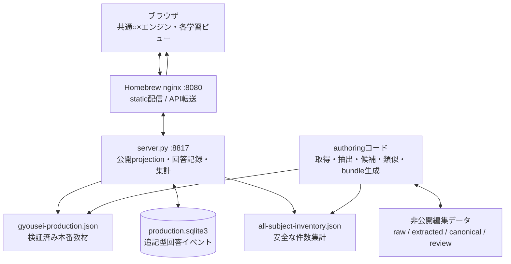
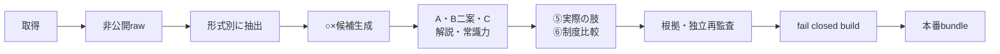
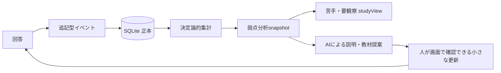

# 行政書士 過去問ラボ 全体構成

- `architectureVersion`: `2026-07-27`
- 更新日: 2026-07-27 JST
- 人間向け構成図: `static/architecture.html`
- AI向け正本: このファイル

このラボは、2026年11月8日の行政書士試験まで約3か月かけて、本人が問題を解きながら教材と分析機能を育てる長期プロジェクトである。直近10年の過去問は全6科目を一つのアプリに掲載済み。○×学習カードは行政法55件・民法25件を掲載済みで、憲法・商法・基礎法学・基礎知識へ順次拡張する。

## 1. 到達したい状態

- 行政法、民法などを科目別に解ける。
- 全分野の頻出論点だけを横断して解ける。
- 正答率の高いカードを通常出題から外し、全問題モードでは再表示できる。
- 回答履歴をサーバーの追記型SQLiteへ保存する。
- AIが集計結果を読み、不得意分野・直近誤答・遅い問題を説明できる。
- 苦手専用の学習ビューや補強カードを、20〜30論点単位で追加できる。
- 行政法と民法など、科目をまたぐ「似ているが結論が違う制度」を関連表示できる。
- 取得素材、編集途中、検証済み本番教材を混ぜない。
- 人間向けHTMLとAI向け本書で、構成を継続的に把握できる。

## 2. 設計原則

1. 回答履歴の正本は `production.sqlite3`。AIは履歴を直接書き換えない。
2. 科目別・全分野頻出・弱点は別アプリや別DBにせず、共通エンジンの `studyView` として作る。
3. 問題ID・カードID・回答revisionを安定させ、教材更新後も過去履歴を失わない。
4. 過去問の保存数、元の肢数、○×候補数、本番公開カード数を別の指標として扱う。
5. 自動類似度は候補探索に使い、学習上の関係は根拠付きのreview済みデータとして保存する。
6. 大量生成より、小さな教材リリースと実際の回答による反復を優先する。
7. 取得元本文・解説は非公開編集領域に置き、ブラウザへ返さない。
8. 2026年度向け法令基準日は `2026-04-01`。
9. 頻出度の正本はreview済みのカード×原問監査データとし、候補単体の
   `frequencyEligible`や文字類似の集計を正本にしない。

## 3. システム構成



### ソース

| 対象 | 場所 |
|---|---|
| アプリ | `~/dev/yuki-services/apps/gyousei-lab/` |
| 静的UI | `static/` |
| API | `server.py` |
| APIテスト | `tests/` |
| 取得・編集・生成コード | `authoring/` |
| 人間向け構成図 | `static/architecture.html` |

### 実行時・非公開データ

| 対象 | 場所 |
|---|---|
| 本番bundle | `~/.local/share/yuki-services/gyousei-lab/gyousei-production.json` |
| 回答履歴 | `~/.local/share/yuki-services/gyousei-lab/production.sqlite3` |
| 最新の弱点分析 | `~/.local/share/yuki-services/gyousei-lab/weakness-latest.json` |
| 世代別の弱点分析 | `~/.local/share/yuki-services/gyousei-lab/analytics/snapshots/` |
| 公開可能な件数集計 | `~/.local/share/yuki-services/gyousei-lab/all-subject-inventory.json` |
| 非公開編集データ | `~/.local/share/yuki-services/gyousei-lab/authoring/` |
| 全分野20年分 | `…/authoring/all_subjects/` |

ソースと実行時データを混在させない。本番DB、bundle、raw、provider解説、AI生ログをソース管理へ入れない。

## 4. 教材作成のデータフロー



### データ層

1. `raw` / `extracted`
   - 取得証跡と問題形式を保存する。
   - provider解説は非公開資料。
2. 候補・編集正本
   - 通常5肢を、安全に真偽推定できる時だけ肢へ分解する。
   - 組合せ、個数、多肢選択、記述、没問、正解なしは問題単位のreview queueへ残す。
3. canonical
   - 安定したID、科目、論点、A・B二案・C、正解、解説、根拠、⑤、必要な⑥を持つ。
4. build / release
   - schema・参照・件数・内部情報漏洩を検証したbundleだけをatomicに本番へ置く。

### 用語の区別

| 用語 | 意味 |
|---|---|
| 問題単位 | 本試験の問番号1つ。択一・多肢・記述を各1問と数える |
| 通常選択肢 | 通常5肢択一の元の肢。原則1問5肢 |
| safe ○×候補 | 正解番号だけから各肢の真偽を安全に決められる厳格候補 |
| 派生カード | 多肢・記述の論点などから独自に作った○×教材 |
| 公開カード | 本番画面へ検証済みとして掲載した教材 |

古い年度のsafe候補は「当時の答えから構造上分解できる」という意味であり、2026年基準の正誤確認済みという意味ではない。

## 5. 現在のデータ量

件数の再現可能な正本は、非公開データから
`gyousei-dataset-inventory` で生成する `data_inventory.json` である。ブラウザへは、問題文・解説・パス・内部IDを含まないruntimeコピーだけを返す。

### 平成18年度〜令和7年度

| 科目 | 問題単位 | 通常5肢の原肢 | safe ○×候補 | 多肢選択 | 空欄 | 記述 |
|---|---:|---:|---:|---:|---:|---:|
| 基礎法学 | 40 | 200 | 75 | 0 | 0 | 0 |
| 憲法 | 120 | 500 | 395 | 20 | 80 | 0 |
| 行政法 | 440 | 1,900 | 1,375 | 40 | 160 | 20 |
| 民法 | 220 | 900 | 555 | 0 | 0 | 40 |
| 商法・会社法 | 99 | 495 | 310 | 0 | 0 | 0 |
| 基礎知識 | 220 | 1,100 | 585 | 0 | 0 | 0 |
| 合計 | 1,139 | 5,095 | 3,295 | 60 | 240 | 60 |

試験全体は1年60問なので20年なら理論上1,200問である。保存数が1,139問なのは、問58〜60の本文が著作権上の理由で20年分60問なく、さらに2017年度問39が取得元の年度一覧にないためである。

行政法440問は全試験ではなく、毎年の行政法22問（通常19、多肢2、記述1）を20年分数えたもの。

### 現在の本番掲載

- 全6科目569問（直近10年）
  - 基礎法学20、憲法60、行政法220、民法110、商法・会社法49、基礎知識110
- ○×学習カード80件（行政法55、民法25）
  - 民法の内訳: 総則5、物権4、担保物権3、債権総論5、債権各論4、親族2、相続2
- 関連過去問肢294件（延べ表示351件）
- 記述30問（行政法10、民法20）
- 類似候補588組

保存素材1,139問と、本番掲載569問・55カードを混同しない。

## 6. 回答履歴と弱点分析



現状:

- SQLite schema `user_version=3`。
- `answer_attempts`、`card_attempts`、`similarity_decisions` は追記型。
- client生成 `eventId` で再送を冪等にする。
- A・C・正解などに基づく `answerRevision` で、改訂前回答を現行習得判定へ混ぜない。
- Bだけの表現変更ではrevisionを変えない。

実装済みの弱点分析MVP:

```text
analytics/snapshots/<timestamp>.json
weakness-latest.json
```

`weakness_analysis.py`が本番SQLiteを読み取り専用で開き、
`gyousei-weakness-snapshot@1`を`0600`でatomic生成する。SQLiteの行やschemaは
変更しない。snapshotは次を持つ。

- `generatedAt`, `analyzerVersion`, `bundleRevision`, `maxAttemptId`
- 科目・topic・subtopic別のカード数、回答数、正解、不正解、正答率
- current revisionだけの直近5回答、連続正誤、最終回答、所要時間
- `targets[]`: cardId、priority、status、reasonCodes、根拠数値
- stale revision、deck外、未知カードを除外した件数

MVPの判定:

- `unlearned`: current revisionの回答0回
- `learning`: 誤答がなく、習得条件にはまだ達していない
- `watch`: 誤答が1回だけ、または最新誤答だが苦手条件未満
- `weak`: 誤答が2回以上あり、直近2回が連続誤答、または直近5回中
  2回以上誤答かつ正答率50%以下
- `recovering`: 過去に苦手条件を満たし、その後の直近2回が連続正解
- `mastered`: 直近3回が連続正解し、`correct - incorrect >= 3`

壁時計による時間減衰は使わない。回答順はクライアント時刻ではなくDBの`id`順とし、
古い誤答は直近5回の窓から外れることで自然に重みを下げる。

`answer_attempts`は過去問単位・科目・topicの集計に使い、カードの苦手判定へ
直接混ぜない。択一誤答を関連カードすべての誤答としてばらまかない。将来反映する
場合は、頻出関係とは別のreview済み`attemptEvidenceRelations`を用意する。

注意:

- AIへ渡す標準データは集計snapshotとし、原則として全回答イベントの生exportを渡さない。
- AI文章はカードIDと数値を引用する。法律説明は検証済みカードを根拠にする。
- `/api/learning-analysis`はsnapshotから固定項目だけを公開する。snapshotが未生成・
  stale・不正なら、同じ判定器でSQLiteから現在値を読み取り専用集計して継続する。
- カード回答の保存成功後は`weakness-latest.json`だけをatomic更新する。世代別snapshotは
  手動分析時に残し、回答イベントや本番bundleは変更しない。

## 7. 学習ビュー

別々のアプリや重複データを作らず、共通のカードrenderer、回答API、履歴を使う。

実装済み:

- `weakness`: 「苦手」「要観察」を優先度順に出す。`recovering`は直近2回連続正解の
  分析状態として残すが、反復対象から外す。通常学習と同じcard ID、renderer、
  `/api/card-attempts`、回答履歴を使う。
- 各カードにcurrent revisionの過去の正解回数・不正解回数を表示する。

今後追加する `studyView`:

- `administrative-law`: 行政法
- `civil-law`: 民法
- `all-subjects-frequent`: 全分野頻出
- `cross-subject`: 分野横断比較
- `all`: 全問題

各viewは `subjectId`、topic、頻出度、弱点score、習得状態などのfilter preset。現在のdeck IDと既存回答互換を壊さず、view IDを回答イベントへ将来追加する。

## 8. 分野横断の類似・比較

次の3種類を混同しない。

1. source choice同士の類似: 頻出度候補を探すため。
2. cardとsource choice: ⑤「実際の肢・本番での聞かれ方」。
3. cardとcard: ⑥「似た制度・他分野との違い」。

将来の第一級データ `learningRelations`:

- endpoints: card/card または card/choice
- `relationType`: `same-proposition`, `opposite`, `exception`, `contrast`, `confusable`, `prerequisite`
- `scope`: 同一科目または分野横断
- 比較軸: 主体、要件、期間、効果、手続など
- 両側の説明、見分け方、根拠choice IDs
- `legalAsOf`, `reviewStatus`, `publishable`

当面は既存 `crossFieldComparisons` を壊さず、builderで互換表示へ投影する。類似度だけで自動公開しない。AIで判断できない少数だけ利用者へ回す。

頻出度はこれらの類似候補から自動確定しない。正本はカード×原問の監査データで、
同じ年度・問番号をカードごとに1回へ重複除去する。`learning_index`は⑤・⑥・
新カードの候補探索専用とし、候補の`frequencyEligible`既定値は`false`にする。
新しい科目はカード作成後に監査を行い、監査前は「頻出でない」ではなく
「未判定」としてfail closedに扱う。

## 9. 多科目化のスケーラビリティ基盤

2026年7月26日に、全1,139問を将来bundleへ追加してもAPI既定limit 1,000で
欠落しない基礎工事を実装した。

1. rawのunderscore科目IDは変更せず、`authoring`の公開bundle境界で
   canonicalなhyphen形式へ変換する。
2. 1,205件・複数科目fixtureで、1,000件目を越えるページ取得をテストする。
3. `/api/questions` は `subjectId`、`year`、`topic`、`format`で絞り込み、
   `limit`、`offset`、`total`、`hasMore`でページングする。
4. `/api/cards` は `subjectId`、`topic`とページングを扱う。
5. `/api/similarities` は、紐づく過去問の科目・年度・topic・formatと
   ページングを扱う。
6. UI初回はoverview、学習カード、弱点分析projectionを読み、過去問、記述、Claude監査、
   類似候補は各タブを初めて開いた時に読む。各ページは250件ずつ最後まで追う。
7. ○×学習はquestions、Claude監査、similaritiesが取得できなくても起動する。

残る一般化は、production bundle builderのカード・監査・類似候補の固定期待値を、
fail closedを保ったままrelease manifest由来へ移すことである。

科目ID変換例:

- `administrative_law` → `administrative-law`
- `civil_law` → `civil-law`
- `basic_knowledge` → `general-knowledge`
- 会社法は公開上 `commercial-law` へ統合する。

## 10. API

現在の主要GET:

- `/health`
- `/api/overview`
- `/api/data-inventory`
- `/api/progress`
- `/api/card-progress`
- `/api/questions`
- `/api/cards`
- `/api/claude-reviews`
- `/api/similarities`
- `/api/export`

主要POST:

- `/api/attempts`
- `/api/card-attempts`
- `/api/similarity-decisions`

`/api/data-inventory` は固定schemaから明示的にprojectionし、問題文、解説、内部パス、内部IDを返さない。集計ファイルがなくてもアプリ全体を落とさず `available: false` を返す。

現在の読取API:

- `/api/learning-analysis`: 弱点snapshotの固定schema公開projection。
  `bundleRevision`と`maxAttemptId`を照合し、stale時は現在値へfallback
- `/api/questions`: `subjectId`、`year`、`topic`、`format`、`limit`、`offset`
- `/api/cards`: `subjectId`、`topic`、`limit`、`offset`
- `/api/similarities`: 紐づく過去問の`subjectId`、`year`、`topic`、`format`、
  および`decisionState`、`limit`、`offset`

将来:

- 追加の`studyViews`と`learningRelations`

## 11. 3か月ロードマップ

### Phase 0: 今〜8月初旬

- 完了: 構成図と動的inventory
- 完了: 没問のsafe候補除外
- 完了: rawを変えないcanonical科目ID変換
- 完了: 1,205件・複数科目fixture
- 完了: API filter/page、タブ遅延読込
- 完了: SQLite backup/quick_checkとruntime権限の確認
- 完了: PC幅・スマホ幅の実Chrome確認（苦手`studyView`追加前）
- 完了: current revisionの`card_attempts`だけを使う弱点分析snapshot MVP
- 完了: 同じカードID・回答履歴を使う苦手`studyView`
- 完了: release manifestで厳密検証した直近10年・全6科目569問の本番掲載
- 完了: 回復中カードの苦手ビュー除外と、カード内の正解・不正解回数表示

### Phase 1: 8月

- 完了（2026-07-27）: 民法の優先25論点（監査schema一般化・独立再監査込み）
- 科目別view（○×学習の科目セレクタは実装済み。filter presetとしての整理が残り）
- 実際の回答でB二案と出題順を調整

### Phase 2: 9月

- 民法拡充
- 行政法と民法の `learningRelations`
- 全分野頻出view
- 週1〜2回の小さな教材release

### Phase 3: 10月前半

- 憲法、商法・会社法、基礎法学、基礎知識を実績優先で追加
- 苦手教材を回答履歴に応じて更新
- 記述論点の○×派生カードを拡充

### Phase 4: 試験前3週

- 新規大量追加を止める
- 全分野混合、記述、直近誤答、弱点回復を中心にする
- 法令基準日と本番bundleを凍結して安定運用する

日々の循環:

```text
解く → サーバー保存 → 集計 → AI分析 → 20〜30論点を編集
→ 検証 → 本番画面で確認 → また解く
```

## 12. 次に行う作業

過去問の多科目化、弱点分析snapshot MVP、苦手`studyView`、カード×原問監査schemaの全科目一般化（`card-frequency-audit@3`）、民法25論点の○×カード追加は完了した。

1. 行政法と民法の`learningRelations`へ進む。
2. 民法の追加論点（次候補: 転貸借、法定地上権、消滅時効期間、錯誤、工作物責任）。
3. 全分野頻出viewと、憲法・商法等の重点追加。

このディレクトリはprivate Gitリポジトリ `yamashita-yukihito/gyousei-lab` で管理する。
親の `yuki-services` はGitリポジトリではないため、親で `git init` しない。

## 13. 更新ルール

次を変えた時は、本書と `static/architecture.html` を同じ変更で更新する。

- 主要なデータフロー、正本、永続化方式
- 主要画面・学習view
- schema、ID、revisionの互換方針
- AI分析・分野横断関係の構造
- 3か月ロードマップ
- データ件数の定義

件数はHTMLへ手入力せず、`all-subject-inventory.json` から表示する。本書の表を更新する時も、生成済みinventoryと照合する。

### Decision log

| 日付 | 決定 |
|---|---|
| 2026-07-26 | Macを開発・実行の正本とした |
| 2026-07-26 | 回答履歴は本人1人・認証/IP分離なしの追記型SQLiteを維持 |
| 2026-07-26 | 科目別・全頻出・弱点は共通エンジンのviewとして実装 |
| 2026-07-26 | 分野横断の学習関係を、頻出度用類似とは別データとして扱う |
| 2026-07-26 | 構成図を人間向けHTMLとAI向けMarkdownの二つで継続更新 |
| 2026-07-26 | raw科目IDを公開bundle境界でcanonical化し、APIページングとタブ遅延読込を導入 |
| 2026-07-26 | PC 1440px・スマホ用CSS幅500pxと各遅延読込タブを実Chromeで確認 |
| 2026-07-26 | 頻出度の正本をカード×原問監査データへ一本化 |
| 2026-07-26 | `card_attempts`のcurrent revisionだけを使う弱点分析snapshot MVPを導入 |
| 2026-07-27 | カード×原問監査schemaを科目別scopeの`card-frequency-audit@3`へ一般化 |
| 2026-07-27 | 民法25論点を同一deckへ`subjectId: civil-law`で追加（別AIによる独立再監査済み） |
| 2026-07-27 | ⑤に組合せ・個数問題の肢も形式を明示して表示し、全80カードが⑤を持つ状態にする |
| 2026-07-27 | カードIDを○×学習と解説カードの画面に表示する |
| 2026-07-27 | 本文の軽量記法による文字装飾を、民法カード5枚で5通り試験導入する |
| 2026-07-27 | ○×学習にことば検索を追加（カードID・論点名・A/B/C・解説・⑤の肢が対象） |
